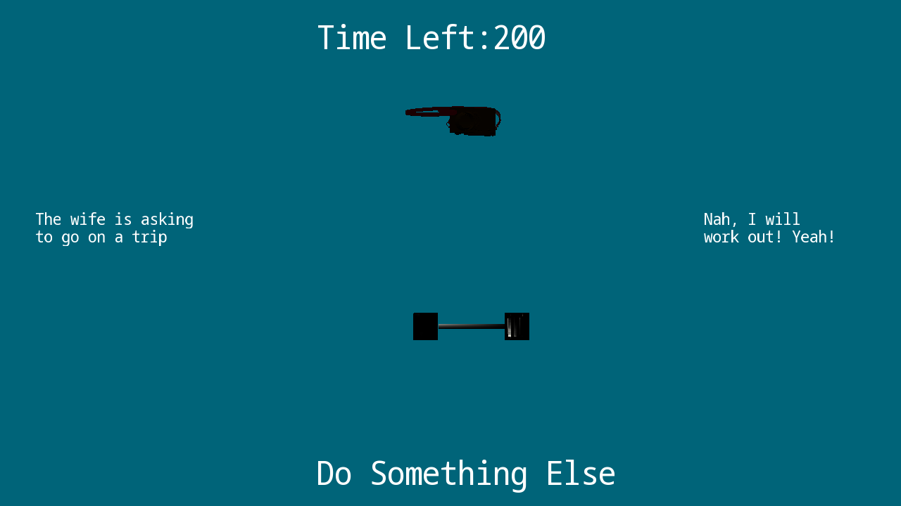

# Mr. Olympian Winner

Author: Rakshit Tikoo

Design: The goal of the game is to workout enough to win Mr. Olympian! Your Dream. But you are a family man, with a social life, and the competition is very closeby. Can you juggle all your familial and social responsibilites, maintain a functioning sleep schedule and still win Mr. Olympian? Can you find all the 9 possible endings?

Text Drawing: The text generation utilizes the code defined in https://learnopengl.com/In-Practice/Text-Rendering
First all the text characters and their textures are loaded into a map, using Free-Type Library. 
Later there is a function that takes in the x, y position, scale and the text to be rendered at runtime, parses the string, 
checks the characters, and renders it onto the screen. 

Choices: There are certain categories of choices stored in separate int variables. 
The choices pop-up on the screen randomly, and the type of choice increases the value of that type of choice variable. 
The choices can be changed using the SpaceBar button. 
You have limited amount of time, and each choice consumes time. 
Once you cross a certain threshold for a choice, you enable a different ending. 

Screen Shot:

How To Play:

The choices randomly appear on the screen. Each choice consumes a certain amount of time. The time left appears on the top of the screen. You select the choice appearing on the left using "A" and the choice on the right using "D". Objects also appear on the screen which might make your choices faster. The top one is for left option, and bottom one is for right one. If you do not like the choices given, you can press SPACEBAR to change the choices, without consuming the time. Based on your choices there are 9 possible endings. The true ending is the most difficult to achieve. After multiple playthroughs you could figure out the choice count for each ending. 

Keys:
"A" : Select choice on the left
"B" : Select choice on the right
"SPACEBAR" : Start/Restart/Change Choice

Sources: 

Majority of the text rendering logic referenced from - https://learnopengl.com/In-Practice/Text-Rendering

Majority of Blender Assets taken from - https://polyhaven.com/

The font is taken from - https://fonts.google.com/

Sound Assets taken from - https://freepd.com/

This game was built with [NEST](NEST.md).

